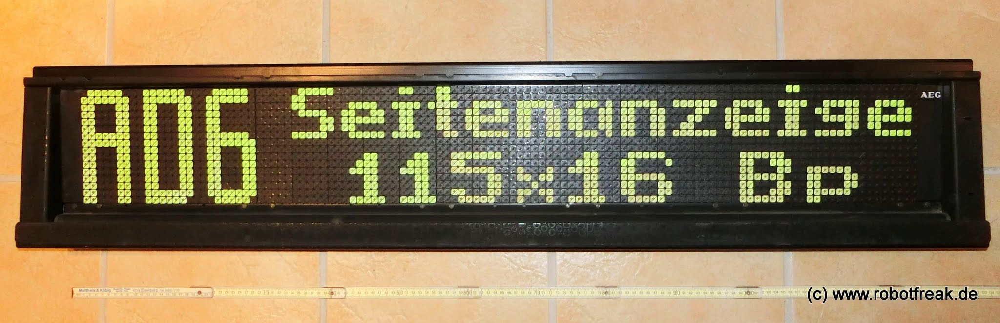

# Flipdot Control

FlipdotCtrl ist eine Programm um bis zu 5 AEG/Annax Flipdot Module mit insgesamt 115x16 Flippdots (3 Module mit 25x16, 2 Module mit 20x16 Pixel) über die serielle Schnittstelle anzusteuern. Text in verschiedenen Fontgrößen sowie einfache Grafiken können dargestellt werden. 

FlipdotCtrl basiert auf dem FlipdotHack von c-hack.de http://c-hack.de/projekte/flipdot-hack/

# Flipdot Uhr

Die Flipdot Uhr besteht aus 2 AEG/Annax Flipdot Modulen mit insgesamt 50x16 Flipdots (2 Module 25x16 Pixel). Neben den Flipdot Modulen wurden die Original Annax Treiber Platinen verwendet. Die Steuerung erfolgte über ein eigenes Steuerungs Board mit Arduino Micro Controller. Bis zu 5 Flipdot Module können an das Steuerungs Board angeschlossen werden. 

Für die Flipdot Uhr wurden zusätzlich ein I2C RTC Modul (DS1307) und ein Temperatur/Feuchtigkeits Sensor (Sparkfun HTU21D) verwendet.
