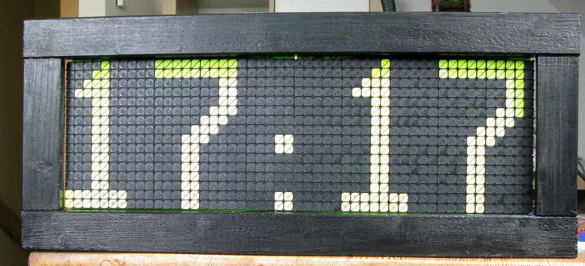

# FlipDot Uhr

Die Flipdot Uhr besteht aus 2 AEG/Annax Flipdot Modulen mit je 25x16 Flipdots. Neben den Flipdot Modulen wurden die Original Annax Treiber Platinen verwendet. Die Steuerung erfolgte über ein eigenes Steuerungs Board mit Arduino Micro Controller. Bis zu 5 Flipdot Module können an das Steuerungs Board angeschlossen werden. 

Für die Flipdot Uhr wurden zusätzlich ein I2C RTC Modul (DS1307) und ein Temperatur/Feuchtigkeits Sensor (Sparkfun HTU21D) verwendet.
